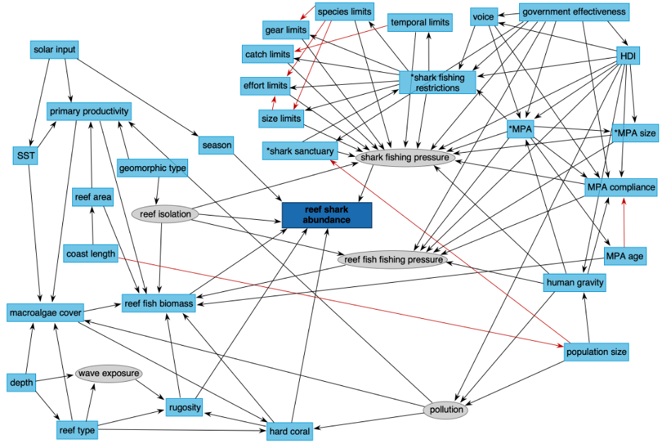

```{r}
#| echo: false
#| error: false
#| warning: false
# load libraries, data, and models
library(sf)
library(tmap)
library(tidyverse)
library(GGally)
library(patchwork)
library(tidybayes)
library(brms)
library(tidybayes)
library(rstan)
library(DHARMa)
library(modelr)
rstan_options(auto_write = TRUE)
options(mc.cores = parallel::detectCores())

# functions for wrangling data
scale_2SD <- function(x) (x-mean(x, na.rm = T))/(2*sd(x, na.rm = T)) # function to mean center and scale continuous predictors (note dividing by 2 standard deviations (as recommended by Gelman))
logtrans <- function(x) log(x + (min(x[x>0], na.rm = T))) # log+min transform for skewed covariates

# flux estimates (g/day) for reef shark species
flux <- read.csv('data/flux-rate-estimates_01-11-2024.csv') |> 
  select(common_name, ingestion_C_g_day, egestion_C_g_day,
         ingestion_N_g_day, egestion_N_g_day, ingestion_P_g_day, egestion_P_g_day, ingestion_C_g_day, egestion_C_g_day) |> 
  filter(common_name %in% c("Grey reef shark", "Whitetip reef shark", "Blacktip reef shark", "Nurse shark", "Caribbean reef shark"))

# shark maxn data with covariates
dat <- read.csv('data/fpdat_final.csv') |> 
  filter(common_name %in% c("", "Grey reef shark", "Whitetip reef shark", "Blacktip reef shark", "Nurse shark", "Caribbean reef shark")) |> 
  # separate fishing restrictions into categorical variables for each limit type
  separate(col = 'fishing_restrictions', 
           into = c('limits1', 'limits2', 'limits3', 'limits4', 'limits5', 'limits6', 'limits7', 'limits8')) |> 
  mutate(gear_limits = ifelse(limits1 == 'gear' | limits2 == 'gear' | limits3 == 'gear' | limits4 == 'gear' | limits5 == 'gear' | limits8 == 'gear', 1, 0),
         species_limits = ifelse(limits1 == 'species' | limits2 == 'species' | limits3 == 'species' | limits4 == 'species' | limits5 == 'species' | limits8 == 'species', 1, 0),
         catch_limits = ifelse(limits1 == 'bag' | limits2 == 'bag' | limits3 == 'bag' | limits4 == 'bag' | limits5 == 'bag' | limits8 == 'bag', 1, 0),
         effort_limits = ifelse(limits1 == 'effort' | limits2 == 'effort' | limits3 == 'effort' | limits4 == 'effort' | limits5 == 'effort' | limits8 == 'effort', 1, 0),
         size_limits = ifelse(limits1 == 'size' | limits2 == 'size' | limits3 == 'size' | limits4 == 'size' | limits5 == 'size' | limits8 == 'size', 1, 0),
         temporal_limits = ifelse(limits1 == 'temporal' | limits2 == 'temporal' | limits3 == 'temporal' | limits4 == 'temporal' | limits5 == 'temporal' | limits8 == 'temporal', 1, 0)) |> 
  # select response and covariates of interest
  select(set_lat, set_long, set_id, reef_id, location_id, region_id, shark_maxn,
         mpa_present, mpa_age, mpa_area, mpa_compliance,
         gear_limits, species_limits, catch_limits, effort_limits, size_limits, temporal_limits,
         shark_protection_status, protection_status, shark_sanctuary, HDI_2015, gov_effect_2016, population_2016, Grav_Total) |>   # make maxn an ordinal response, and the other categorical variables factors
  # put continuous covariates on same scale as binary by dividing by 2 standard deviations (as recommended by Gelman), also mean center to improve interpretation of coeffs in presence of interactions
  mutate(#shark_cat = factor(ifelse(shark_maxn > 1, '> 1', shark_maxn), order = T, levels = c('0','1','> 1')),
    mpa_compliance = ifelse(mpa_compliance == 'high', 1, 0),
    #shark_protection_status = ifelse(shark_protection_status == 'closed' & protection_status == 'closed' & mpa_compliance == 'high' & mpa_area > 9.9 & mpa_age > 9, 'closed_plus', shark_protection_status),
    mpa_present = ifelse(mpa_present == 'yes', 1, 0),
    across(c(mpa_present:temporal_limits), ~ifelse(is.na(.), 0, .)),
    across(c(set_id:region_id, mpa_present, mpa_compliance:shark_sanctuary), factor),
    across(c(mpa_age, mpa_area, population_2016, Grav_Total), logtrans),
    across(c(mpa_age, mpa_area, HDI_2015, gov_effect_2016, population_2016, Grav_Total), scale_2SD),
    shark_protection_status = relevel(factor(shark_protection_status), ref = "open"))

# estimate total flux at each set across species
dat_flux <- read.csv('data/fpdat_final.csv') |> 
  filter(#region_name == "Coral Triangle",
    common_name %in% c("", "Grey reef shark", "Whitetip reef shark", "Blacktip reef shark", "Nurse shark", "Caribbean reef shark")) |> 
  inner_join(flux) |> # join flux estimates
  mutate(across(c(ingestion_C_g_day:egestion_P_g_day), ~ . * shark_maxn)) |> # estimate total fluxes given number of individuals observed
  group_by(set_lat, set_long, set_id, reef_id, location_id, region_id) |> 
  summarise(across(c(ingestion_C_g_day:egestion_P_g_day), sum)) |> # total fluxes summed across species
  ungroup() |> 
  mutate(across(c(set_id:region_id), factor)) |> 
  left_join(dat)

# load saved models and model outputs
load('outputs/models/global_models.rda')
pred_zinb <- read.csv('outputs/models/scenario-predictions_zinb.csv')
#load('outputs/models/global_zinb_qresiduals.rda')
```

#### Background

##### Problem Statement

Widespread overexploitation has caused precipitous declines in shark populations, to the extent that they are functionally extinct on 20% of the world's coral reefs (Macneil et al. 2020). The loss of these predators has significant impacts on coral reef functioning as well as the tropical fisheries and tourism industries that they support.

##### Knowledge gap

A suite of management initiatives have been implemented to mitigate the impacts of shark overexploitation, including protection efforts that either restrict fishing (e.g., effort limits) or prohibit shark fishing altogether. However, the impact of these management initiatives on reef shark abundance and key ecological processes has not yet been quantified globally.

##### Novel Contributions

Here we use counterfactual modelling to estimate how much of a difference management has made to both shark abundance and a key ecological process (ingestion rate) conducted by sharks. We also explore synergies and trade offs to find whether there are 'sweet spots' where management could help maximise multiple outcomes, and alternatively locations were management makes minimal differences to one or more outcome.

##### Research Questions

1.) What difference have existing management strategies made to reef shark abundance and ingestion rates across the worlds coral reefs?

2.) What are the potential conservation gains of closing reefs to shark fishing for both reef shark abundance and ingestion rates?

3.) Are there synergies and/or trade-offs in where management could maximise reef shark abundance and ingestion rate?

#### How we innovate

##### Counterfactual modelling

Here we aim to estimate the causal effects of existing management strategies on reef shark relative abundance (MaxN) and carbon ingestion rates to enable robust predictions of these outcomes under counterfactual management scenarios. Specifically, we consider two counterfactual scenarios: 1) all reefs are open to shark fishing, and 2) all reefs are closed to shark fishing. We compare outcomes predicted under these scenarios to the status quo (i.e., current reef shark abundance and carbon ingestion rates) to quantify how much impact management *has* or *could* have.

##### Data

Relative reef shark abundance (MaxN) was observed at replicate sites in coral reefs globally ([Global FinPrint](https://globalfinprint.org)). We subset the observations for the following reef shark species: Grey reef shark, Whitetip reef shark", "Blacktip reef shark", "Nurse shark", "Caribbean reef shark". We chose these reef-associated shark species as they make up the majority of our data (\~86% of total abundance) and there are large amounts of empirical data on their diet and movement metrics (especially activity space see [Dwyer et al. 2020](https://www.cell.com/current-biology/fulltext/S0960-9822(19)31600-8)). This information will be useful when we investigate ingestion/egestion rates of these species.

Typically, shark ingestion and egestion is difficult to observe and quantify, but advances in bioenergetics and ecological stoichiometry provide a tractable avenue to overcome this limitation. In coral reefs, fishes are key vectors in the storage and flux of carbon, nitrogen and phosphorous. Disentangling how fishes allocate ingested resources into biomass and waste products can link individual physiology to ecosystem processes. Here, we use the R package [“Fishflux” (Schiettekatte et al. 2020)](https://nschiett.github.io/fishflux/index.html) to estimate reef shark carbon ingestion rates.

#### Figures and results (preliminary)

**Note that the preliminary results presented here only address Research questions 1 and 2 for reef shark abundance. Ingestion rate models are still in development**

##### Map of the study area

In the below map, reefs are categorised as either open to shark fishing, restricted, or closed.

::: panel-tabset
###### Shark protection status of MPAs

```{r}
#| warning: false
tmap_mode('view')

dat.sf <- dat |> 
  st_as_sf(coords = c('set_long', 'set_lat'), crs = 4326)
qtm(dat.sf, dots.col = 'shark_protection_status')
```

###### Reef shark relative abundance (MaxN)

```{r}
#| warning: false
tmap_mode('view')

dat.sf <- dat |> 
  st_as_sf(coords = c('set_long', 'set_lat'), crs = 4326)
qtm(dat.sf, dots.col = 'shark_maxn')
```
:::

##### Key Result 1: Effects of management strategies on the relative abundance of reef sharks

Most management strategies have a positive effect on the relative abundance of reef sharks, except for the presence of MPAs, gear limits, and species limits (see figure below). Human gravity has a negative effect on reef shark relative abundance, but the strength of this relationship is stronger on reefs where shark fishing is open or restricted relative to those that are closed.

*Note that the effect of different levels of shark protection status should be interpreted in reference to MPAs that are open to shark fishing.*

```{r,fig.width=8, fig.height=8, fig.align='center'}
#| error: false
#| warning: false
a <- mcmc_plot(fit_zinb_int, #variable = c("b_mpa_present1", 'b_mpa_age', 'b_mpa_area', 'b_mpa_compliance', 'b_gear_limits1', 'b_species_limits1', 'b_catch_limits1', 'b_effort_limits1', 'b_size_limits1', 'b_temporal_limits1', 'b_Grav_Total', 'b_shark_sanctuary', 'b_shark_protection_statusclosed','b_shark_protection_statusrestricted', 'shark_protection_statusclosed:Grav_Total', 'shark_protection_statusclosed_plus:Grav_Total', 'shark_protection_statusrestricted:Grav_Total'), 
               variable = '^b_',
               regex = TRUE) +labs(x='Standardised effect size (50 and 95% CIs)') + theme_classic() + ggtitle('Effect sizes')

b <- plot(conditional_effects(fit_zinb_int, effects = 'Grav_Total:shark_protection_status', categorical = F, prob = c(0.75)), plot = FALSE, 
          #points = TRUE, point_args = list(width = 0.1, size = 0.8, alpha = 0.3)
          )[[1]] + theme_classic() + ggtitle('Shark protection status & Gravity Interaction')
a/free(b)

c <- mcmc_plot(fit_lognormal_int,
               variable = '^b_',
               regex = TRUE) +labs(x='Standardised effect size (50 and 95% CIs)') + theme_classic() + ggtitle('Effect sizes')

d <- plot(conditional_effects(fit_lognormal_int, effects = 'Grav_Total:shark_protection_status', categorical = F, prob = c(0.75)), plot = FALSE, 
          #points = TRUE, point_args = list(width = 0.1, size = 0.8, alpha = 0.3)
          )[[1]] + theme_classic() + ggtitle('Shark protection status & Gravity Interaction')
c/free(d)

e <- mcmc_plot(fit_guassian_int,
               variable = '^b_',
               regex = TRUE) +labs(x='Standardised effect size (50 and 95% CIs)') + theme_classic() + ggtitle('Effect sizes')

f <- plot(conditional_effects(fit_guassian_int, effects = 'Grav_Total:shark_protection_status', categorical = F, prob = c(0.75)), plot = FALSE, 
          #points = TRUE, point_args = list(width = 0.1, size = 0.8, alpha = 0.3)
          )[[1]] + theme_classic() + ggtitle('Shark protection status & Gravity Interaction')
e/free(f)
```

##### Key Result 2: Quantifying the impact of closing reefs to shark fishing

Compared to the status quo, our model predicts that the relative abundance of reef sharks would be **29%** lower if all reefs were open to shark fishing and **6%** higher if all reefs were closed to shark fishing (but note the overlapping uncertainty intervals in these scenarios (+- 1 SD)).

```{r}
#| eval: false
# create scenario data
no_management <- fit_zinb_int$data |> 
  mutate(#across(c(mpa_present, effort_limits, gear_limits:temporal_limits, shark_sanctuary), ~ 0),
         #mpa_age = min(mpa_age), # setting at minimum amount 
         #mpa_area = min(mpa_area),
         shark_protection_status = 'open')
management <- fit_zinb_int$data |> 
    mutate(#mpa_present == 1,
         #mpa_age = max(mpa_age), # setting at minimum amount 
         #mpa_area = max(mpa_area),
         shark_protection_status = 'closed')

# make predictions from the posterior and summarise outcomes at each site
# then get the median value for each site and use to arrange sites from highest to lowest
base_preds_zinb <- fit_zinb_int$data |> 
  add_predicted_draws(fit_zinb_int) |> 
  group_by(set_id, reef_id, location_id, region_id) |> 
  summarise(Relative_abundance = median(.prediction),
            Variance = var(.prediction)) |>
  group_by(reef_id, location_id, region_id) |> # here averaging across sets to aggregate to reef level 
  summarise(Relative_abundance = mean(Relative_abundance),
            Variance = mean(Variance)) |>
  arrange(desc(Relative_abundance)) |> 
  ungroup() |> 
  mutate(Scenario = 'Status quo',
         Site = 1:length(unique(dat$reef_id)),
         `% Sites` = ((1:n())/length(unique(dat$reef_id)))*100,
         `Cumulative relative abundance` = cumsum(Relative_abundance),
         Cumulative_variance = cumsum(Variance),
         y_upp = `Cumulative relative abundance` + sqrt(Cumulative_variance),
         y_low = `Cumulative relative abundance` - sqrt(Cumulative_variance),
         y_low = ifelse(y_low < 0, 0, y_low))

no_management_zinb <- no_management |> 
  add_predicted_draws(fit_zinb_int) |> 
  group_by(set_id, reef_id, location_id, region_id) |> 
  summarise(Relative_abundance = median(.prediction),
            Variance = var(.prediction)) |> 
  group_by(reef_id, location_id, region_id) |> # here averaging across sets to aggregate to reef level 
  summarise(Relative_abundance = mean(Relative_abundance),
            Variance = mean(Variance)) |>
  arrange(desc(Relative_abundance)) |>
  ungroup() |> 
  mutate(Scenario = 'No management',
         Site = 1:length(unique(dat$reef_id)),
         `% Sites` = ((1:n())/length(unique(dat$reef_id)))*100,
         `Cumulative relative abundance` = cumsum(Relative_abundance),
         Cumulative_variance = cumsum(Variance),
         y_upp = `Cumulative relative abundance` + sqrt(Cumulative_variance),
         y_low = `Cumulative relative abundance` - sqrt(Cumulative_variance),
         y_low = ifelse(y_low < 0, 0, y_low))

management_zinb <- management |> 
  add_predicted_draws(fit_zinb_int) |> 
  group_by(set_id, reef_id, location_id, region_id) |> 
  summarise(Relative_abundance = median(.prediction),
            Variance = var(.prediction)) |> 
  group_by(reef_id, location_id, region_id) |> # here averaging across sets to aggregate to reef level 
  summarise(Relative_abundance = mean(Relative_abundance),
            Variance = mean(Variance)) |>
  arrange(desc(Relative_abundance)) |>
  ungroup() |> 
  mutate(Scenario = 'Management everywhere',
         Site = 1:length(unique(dat$reef_id)),
         `% Sites` = ((1:n())/length(unique(dat$reef_id)))*100,
         `Cumulative relative abundance` = cumsum(Relative_abundance),
         Cumulative_variance = cumsum(Variance),
         y_upp = `Cumulative relative abundance` + sqrt(Cumulative_variance),
         y_low = `Cumulative relative abundance` - sqrt(Cumulative_variance),
         y_low = ifelse(y_low < 0, 0, y_low))

write.csv(bind_rows(base_preds_zinb, no_management_zinb, management_zinb), 
          'outputs/models/scenario-predictions_zinb.csv', row.names = F)

# calculate percent change between counterfactuals and status quo
(abs(filter(pred_zinb, X..Sites == 100 & Scenario == 'Status quo')$Cumulative.relative.abundance - filter(pred_zinb, X..Sites == 100 & Scenario == 'No management')$Cumulative.relative.abundance))/filter(pred_zinb, X..Sites == 100 & Scenario == 'Status quo')$Cumulative.relative.abundance

(abs(filter(pred_zinb, X..Sites == 100 & Scenario == 'Status quo')$Cumulative.relative.abundance - filter(pred_zinb, X..Sites == 100 & Scenario == 'Management everywhere')$Cumulative.relative.abundance))/filter(pred_zinb, X..Sites == 100 & Scenario == 'Status quo')$Cumulative.relative.abundance
```

```{r,fig.width=6.5, fig.height=4, fig.align='center'}
#| error: false
#| warning: false

# plot
pred_zinb |> 
  mutate(Scenario = factor(case_when(Scenario == 'Management everywhere' ~ 'All reefs closed to shark fishing',
                                     Scenario == 'No management' ~ 'All reefs open to shark fishing',
                                     .default = 'Status quo'), levels = c('All reefs closed to shark fishing', 'Status quo', 'All reefs open to shark fishing'))) |> 
  ggplot() +
  geom_ribbon(aes(x = X..Sites, ymin = y_low, ymax = y_upp, fill = Scenario), alpha = 0.2) +
  geom_line(aes(x = X..Sites, y = Cumulative.relative.abundance, col = Scenario)) +
  #ggtitle('Relative abundance') +
  xlab('% of Reefs') +
  ylab('Cumulative relative abundance') +
  theme_classic()
```

#### Methods

##### Covariate selection for estimating causal effects of management

Covariates were selected based on a directed acyclic graph (DAG) of social and ecological causes of reef shark abundance globally (Fig XX. Developed by Klinard et al. (*in prep*)). We used the backdoor criterion (Pearl, 1993) to identify the minimally sufficient set of covariates to adjust for to obtain unbiased estimates of the total causal effects of marine protected area presence (MPA) and their size, compliance, age, and type of shark fishing restrictions (open, closed, restricted); whether there are limits placed on the type of species caught, gear used, catch amount, size, or temporality of fishing; whether the reef is located in a shark sanctuary; and human gravity.

The minimal sufficient covariate adjustment set was: Human Development Index (HDI), government effectiveness, and population size. Prior to fitting the model, all skewed continuous covariates were log(x+min) transformed and all continuous covariates were mean centered and scaled by subtracting the mean value and dividing by 2 standard deviations (Gelman, 2007) to estimate standardised effect sizes.



Pairwise correlation plots of the responses and covariates.

```{r,fig.width=12,fig.height=9, fig.align='center'}
#| warning: false
#| error: false
ggpairs(select(dat, shark_maxn:Grav_Total))
```

##### Model structure

We used Bayesian multilevel regression models to estimate the causal effects of management on the relative abundance of reef sharks (MaxN). We included nested random intercepts for set, reef, nation, and marine ecoregion to account for spatial hierarchies in the observed data and an interaction between human gravity and shark protection status of reefs.

Relative abundance (MaxN) was zero-inflated and over-dispersed and so we fitted the relative abundance model with a zero-inflated negative binomial distribution (log link). We set weakly informative priors for all parameters in both models and used prior predictive checking to ensure that they were consistent with the data.

```{r}
#| eval: false
# set weakly informative priors and only sample the priors to do a prior predictive check
# abundance model
# minimal sufficient adjustment set:HDI, MPA, MPA compliance, government effectiveness, human gravity, population size
fit_prior_zinb_int <- brm(shark_maxn ~ gear_limits + species_limits + catch_limits + effort_limits + size_limits + temporal_limits + shark_protection_status + shark_sanctuary + HDI_2015 + I(HDI_2015^2) + mpa_present + mpa_compliance + gov_effect_2016 + Grav_Total + population_2016 + shark_protection_status:Grav_Total + (1|region_id/location_id/reef_id/set_id),
                      prior = c(prior(normal(0, 2), class = b)), # leaving intercept and sd as default priors
                      iter = 2000, warmup = 1000, cores = 4, chains = 4, thin = 1,
                      data = dat, family = zero_inflated_negbinomial(), 
                      control = list(max_treedepth = 15, adapt_delta = 0.99),
                      sample_prior = "only")

fit_zinb_int <- brm(shark_maxn ~ gear_limits + species_limits + catch_limits + effort_limits + size_limits + temporal_limits + shark_protection_status + shark_sanctuary + HDI_2015 + I(HDI_2015^2) + mpa_present + mpa_compliance + gov_effect_2016 + Grav_Total + population_2016 + shark_protection_status:Grav_Total + (1|region_id/location_id/reef_id/set_id),
                       prior = c(prior(normal(0, 2), class = b)), # leaving intercept and sd as default priors
                iter = 2000, warmup = 1000, cores = 4, chains = 4, thin = 1,
                data = dat, family = zero_inflated_negbinomial(), 
                control = list(max_treedepth = 15, adapt_delta = 0.99))

# ingestion model
# minimal sufficient adjustment set: HDI, MPA, MPA age, MPA compliance, government effectiveness, human gravity, population size
fit_prior_lognormal_int <- brm(ingestion_C_g_day ~ gear_limits + species_limits + catch_limits + effort_limits + size_limits + temporal_limits + shark_protection_status + shark_sanctuary + HDI_2015 + I(HDI_2015^2) + mpa_present + mpa_compliance + gov_effect_2016 + Grav_Total + population_2016 + shark_protection_status:Grav_Total + (1|region_id/location_id/reef_id/set_id),
                                        prior = c(prior(normal(0, 2), class = b)), # leaving intercept and sd as default priors
                                        iter = 4000, warmup = 1000, cores = 4, chains = 4, thin = 1,
                                        data = dat_flux, family = lognormal, 
                                        control = list(max_treedepth = 15, adapt_delta = 0.99),
                                        sample_prior = "only")

fit_lognormal_int <- brm(ingestion_C_g_day ~ gear_limits + species_limits + catch_limits + effort_limits + size_limits + temporal_limits + shark_protection_status + shark_sanctuary + HDI_2015 + I(HDI_2015^2) + mpa_present + mpa_compliance + gov_effect_2016 + Grav_Total + population_2016 + shark_protection_status:Grav_Total + (1|region_id/location_id/reef_id/set_id),
                                  prior = c(prior(normal(0, 2), class = b)), # leaving intercept and sd as default priors
                                  iter = 4000, warmup = 1000, cores = 4, chains = 4, thin = 1,
                                  data = dat_flux, family = lognormal(), 
                                  control = list(max_treedepth = 15, adapt_delta = 0.99))

fit_prior_guassian_int <- brm(log(ingestion_C_g_day) ~ gear_limits + species_limits + catch_limits + effort_limits + size_limits + temporal_limits + shark_protection_status + shark_sanctuary + HDI_2015 + I(HDI_2015^2) + mpa_present + mpa_age + mpa_compliance + gov_effect_2016 + Grav_Total + population_2016 + shark_protection_status:Grav_Total + (1|region_id/location_id/reef_id/set_id),
                                        prior = c(prior(normal(0, 2), class = b)), # leaving intercept and sd as default priors
                                        iter = 2000, warmup = 1000, cores = 4, chains = 4, thin = 1,
                                        data = dat_flux, #family = lognormal, 
                                        control = list(max_treedepth = 15, adapt_delta = 0.99),
                                        sample_prior = "only")

fit_guassian_int <- brm(log(ingestion_C_g_day) ~ gear_limits + species_limits + catch_limits + effort_limits + size_limits + temporal_limits + shark_protection_status + shark_sanctuary + HDI_2015 + I(HDI_2015^2) + mpa_present + mpa_age + mpa_compliance + gov_effect_2016 + Grav_Total + population_2016 + shark_protection_status:Grav_Total + (1|region_id/location_id/reef_id/set_id),
                                  prior = c(prior(normal(0, 2), class = b)), # leaving intercept and sd as default priors
                                  iter = 4000, warmup = 1000, cores = 4, chains = 4, thin = 1,
                                  data = dat_flux, #family = lognormal, 
                                  control = list(max_treedepth = 15, adapt_delta = 0.99))

# compare predictive accuracy of model with and without interaction
fit_lognormal_int <- add_criterion(fit_lognormal_int, 'waic')
fit_guassian_int <- add_criterion(fit_guassian_int, 'waic')

# save models 
save(#fit_prior_zinb_int,
     fit_zinb_int,
     #fit_prior_lognormal_int,
     fit_lognormal_int,
     #fit_prior_guassian_int,
     fit_guassian_int,
     file = "outputs/models/global_models.rda")
```

```{r,fig.width=6,fig.height=3, fig.align='center'}
#| error: false
#| warning: false
pp_check(fit_prior_zinb_int, type = 'bars') + xlim(c(0,30))
```

##### Model convergence and fit

We estimated model parameters via Hamiltonian Monte Carlo No-U turn (NUTs) MCMC sampling with 4 chains, each with 4000 iterations, 1000 burn-in and a thinning rate of 1, for a total of 12000 posterior samples. We evaluated MCMC sampling convergence for each parameter by visually inspecting the posteriors and sampling trace plots and via quantitative diagnostics: the Gelman-rubin convergence statistic (R-hat) and effective sample size.

Posterior traces:

```{r}
#| error: false
#| warning: false
plot(fit_zinb_int)
plot(fit_lognormal_int)
plot(fit_guassian_int)
```

Quantitative diagnostics:

```{r}
#| error: false
#| warning: false
summary(fit_zinb_int)
```

Structural model assumptions of residual homoskedasticity and normality were evaluated using [simulated randomised quantile residuals (Dunn & Smyth, 1996; Hartig, 2024)](https://cran.r-project.org/web/packages/DHARMa/vignettes/DHARMa.html).

```{r}
#| eval: false
#qresids <- createDHARMa(
 # simulatedResponse = t(posterior_predict(fit_zinb)),
  #observedResponse = fit_zinb$data$shark_maxn,
  #fittedPredictedResponse = apply(t(posterior_epred(fit_zinb)), 1, mean),
  #integerResponse = TRUE)
qresids_int <- createDHARMa(
  simulatedResponse = t(posterior_predict(fit_zinb_int)),
  observedResponse = fit_zinb_int$data$shark_maxn,
  fittedPredictedResponse = apply(t(posterior_epred(fit_zinb_int)), 1, mean),
  integerResponse = TRUE)
qresids_lognormal_int <- createDHARMa(
  simulatedResponse = t(posterior_predict(fit_lognormal_int)),
  observedResponse = fit_lognormal_int$data$ingestion_C_g_day,
  fittedPredictedResponse = apply(t(posterior_epred(fit_lognormal_int)), 1, mean),
  integerResponse = FALSE)
qresids_guassian_int <- createDHARMa(
  simulatedResponse = t(posterior_predict(fit_guassian_int)),
  observedResponse = log(fit_guassian_int$data$ingestion_C_g_day),
  fittedPredictedResponse = apply(t(posterior_epred(fit_guassian_int)), 1, mean),
  integerResponse = FALSE)
save(qresids_int, 
     qresids_lognormal_int,
     qresids_guassian_int,
     file = 'outputs/models/global_zinb_qresiduals.rda')
```

```{r}
#| error: false
#| warning: false
plot(qresids_int)
plot(qresids_lognormal_int)
plot(qresids_guassian_int)
```

We checked for spatial autocorrelation in residuals (see Moran's I test and mapped residuals below). There is evidence for residual spatial autocorrelation, so we will include a spatial conditional autoregressive term in the next iteration of models to account for this.

```{r}
#| error: false
#| warning: false
dat$set_lat2 <- dat$set_lat
dat$set_long2 <- dat$set_long
while(nrow(dat[which(duplicated(select(dat, set_lat2, set_long2))),])>0){
  dat$duplicated <- duplicated(select(dat, set_lat2, set_long2))
  dat <- dat |> 
    mutate(set_lat2 = ifelse(duplicated == TRUE, set_lat2 + runif(1, 0, 0.000000001), set_lat2),
           set_long2 = ifelse(duplicated == TRUE, set_long2 + runif(1, 0, 0.000000001), set_long2))
  }

testSpatialAutocorrelation(qresids_int, dat$set_long2, dat$set_lat2)
```

```{r}
#| warning: false
tmap_mode('view')

dat.sf <- dat |> 
  mutate(qresids = qresids_int$scaledResiduals) |> 
  st_as_sf(coords = c('set_long2', 'set_lat2'), crs = 4326)
qtm(dat.sf, dots.col = 'qresids')
```

Model fit was evaluated by plotting observed data against posterior predictive distributions.

```{r,fig.width=6,fig.height=3, fig.align='center'}
#| error: false
#| warning: false
pp_check(fit_zinb_int, type = 'bars')
pp_check(fit_lognormal_int)
pp_check(fit_guassian_int)
```

#### Additional notes for co-authors

We have not taken steps to evaluate covariates for multi-collinearity and drop them from the model. Because we have used structural causal modelling to select covariates, our coefficient estimates should be unbiased regardless of multicollinearity (although may be more uncertain). See this [relevant simulation study for more info](https://pmc.ncbi.nlm.nih.gov/articles/PMC5131787/).

#### Next steps

In addition to refining the abundance model, our next steps are also to model reef shark carbon ingestion rate under counterfactual management scenarios. Ingestion rates have been calculated by Sophie Tattrie. Briefly, the package "fishflux" was used to model fluxes in Carbon, Nitrogen, Phosphorus (CNP) in sharks (Schiettekatte et al. 2020). This package allows us to to predict ingestion, egestion and excretion to study fluxes of nutrients and energy. Input parameters include those for metabolism, growth, diet and body composition. Output parameters include ingestion and egestion of CNP as well growth attributed to and total inorganic flux of each element (g/day). Input parameters were sourced from the literature where available and are otherwise in the process of being modelled/imputed. Species within the FinPrint dataset are being incorporated, though currently only sharks whose growth parameters were available on either fishbase or sharkipedia are included in the initial model.

We will then map areas where there are synergies or trade-offs in reef shark abundance and carbon ingestion rate with increased management to address Research Question 3.

#### R session Info

```{r}
sessionInfo()
```
